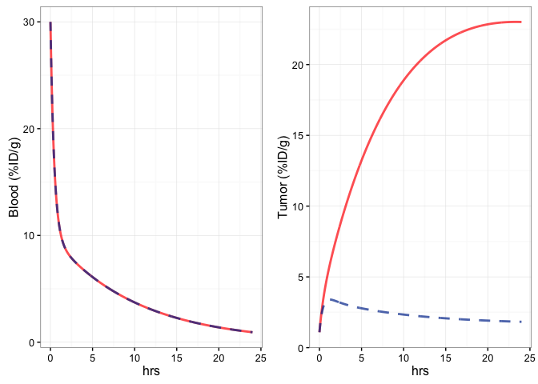

# Demo - Simulation of Antibody Drug Uptake in the Tumor

###This simulation allows user to predict the time course of antibody uptake.

* notice, this simulation assumes "antigen/target is not saturable" or "antigen/target concentration is way more than the antibody drug"

#### User Inputs 

1. tweak the molecular weight of the drug
2. tweak the blood clearance rate (2 phases)

```r
MW = 15 # molecular weight of the molecule, unit: kDa
L_1 = 20 # the initial signal in phase A, unit: %ID/g
L_2 = 10 # the initial signal in phase B, unit: %ID/g
lbd1 = 54.3 # phase A clearance rate, unit: 1/day
lbd2 = 2.37 # phase B clearance rate, unit: 1/day
```

* more advanced variables for tweaking

```r
library(ggplot2) 
library(ggthemes)
library(reshape)
library(deSolve)
require(gridExtra)
```

```
## Loading required package: gridExtra
```

```r
doses = c(15.25e-5) # mg/kg, dose is not important here for the 'non-saturable' model
mouse_weight = 20 # g
KD = 2 # nM
hematocrit = 0.45

# calculate Ktrans from estimated P_day
source("~/Initial_parameters.R")
iniP = Initial_parameters(MW=MW)
P_day = iniP[["P"]] # P unit: cm/day
S_over_V = 23 # 1/cm
k_trans = S_over_V*P_day/24/60 # 1/min

parms = c(L1=L_1, L2=L_2, lambda1=lbd1, lambda2=lbd2, epsilon = 0.165, v_e=0.165, v_p = 0.020, k_trans = k_trans, k_ns = 0.21, k_elim = 0, Ag = 25, K_D=KD, k_endo = 0) 
```

####Model for Antibody Drug Uptake 

```r
tumor_residualizing_predictions_nonsaturation <- function(t,y,parms=parms){
  
  p        <- parms
  L1 = p[['L1']]
  L2 = p[['L2']]
  lambda1 = p[['lambda1']]
  lambda2 = p[['lambda2']]
  
  Ag=p['Ag']
  v_p=p['v_p']
  k_ns=p['k_ns']
  k_elim=p['k_elim']
  k_endocytosis=p['k_endo']
  K_D=p['K_D']
  ve=p['v_e']
  
  Rl_p <- (L1*exp(-lambda1*t) +  L2*exp(-lambda2*t))/(1-hematocrit)
  
  # Interstitial radiolabel, concentration in total tumor volume
  f_u <<- K_D/(Ag/ve + K_D)
  
  Rl_i.st_unsat = y[1]
  yd1 = (p['k_trans']*(60*24)*Rl_p - p['k_trans']*(60*24)*f_u*Rl_i.st_unsat/p['epsilon'] - (k_endocytosis*(1 - f_u) + k_ns*f_u)*Rl_i.st_unsat/p['epsilon'])
  Rl_i.c_unsat = y[2]
  yd2 = (k_endocytosis*(1 - f_u) + k_ns*f_u)*Rl_i.st_unsat/p['epsilon'] - k_elim*Rl_i.c_unsat/(1-ve)
  
  # [Rl] in plasma, concentration in total tumor volume:
  RRl_p <- Rl_p*v_p   
  list(c(yd1,yd2),Rl_p*(1-hematocrit),y[1] + y[2] + RRl_p,f_u)
} # end of Function
```

####Calculating uptake signals for:

####1. binding drug
####2. non-binding drug (control)

```r
initial_conditions = c(0,0)
t_hr = 24 # time course of uptake curve
t_day = t_hr/24
prediction_times = seq(0,t_day,length=1000)

# create animal list that will be combine with the data
dose_list = sapply(1:length(doses), function(x) {
  rep(doses[x], length(prediction_times)) # generate the animal list which will be combined with the simulated dataframe
})
dose_list = melt(dose_list)['value']

## Non-Binding control ##
datalist_sat_con = list()
for (i in 1:length(doses)){
  dose = doses[i]
  parms['K_D'] = 100000 # 100 uM, like a nonbinding control
 
  Rl_sat_con <- lsoda(y=initial_conditions,times=prediction_times,func=tumor_residualizing_predictions_nonsaturation,parms=parms, rtol=1e-6, atol=1e-6)
  colnames(Rl_sat_con) <- c('days','Rl_i.st','Rl_i.c','Rl_blood','Rl_total_sat','f_u')
  
  time_hr = Rl_sat_con[,'days']*24
  datalist_sat_con[[i]] = data.frame(time_hr,Rl_sat_con[,'Rl_blood'], Rl_sat_con[,'Rl_total_sat'])
  colnames(datalist_sat_con[[i]]) = c('hrs','heart','tumor')
}
datalist_sat_con = do.call(rbind, datalist_sat_con)
datalist_sat_con['dose'] = dose_list

## Binding Molecule ##
datalist_sat = list()
for (i in 1:length(doses)){
  dose = doses[i]
  parms['K_D'] = KD # change the KD back to the binding molecule's Kd

  Rl_sat <- lsoda(y=initial_conditions,times=prediction_times,func=tumor_residualizing_predictions_nonsaturation,parms=parms, rtol=1e-6, atol=1e-6)
  colnames(Rl_sat) <- c('days','Rl_i.st','Rl_i.c','Rl_blood','Rl_total_sat','f_u')

  time_hr = Rl_sat[,'days']*24
  datalist_sat[[i]] = data.frame(time_hr,Rl_sat[,'Rl_blood'], Rl_sat[,'Rl_total_sat'])
  colnames(datalist_sat[[i]]) = c('hrs','heart','tumor')
}
datalist_sat = do.call(rbind, datalist_sat)
datalist_sat['dose'] = dose_list
```

####Plotting the simulated result

```r
# colors for the plot
cols <- c("#666666", "#999999")

p_heart_all = ggplot(data = datalist_sat, aes(x=hrs, y=heart, colour = factor(dose))) +
  geom_line(color="#FF0000", size=1, alpha=0.7) +
  geom_line(data = datalist_sat_con, aes(x=hrs, y=heart, colour = factor(dose)), color = "#003399", size=1, alpha=0.7, linetype=2) +
  scale_colour_manual(values = cols) +
  labs(x = 'hrs', y = 'Blood (%ID/g)') +
  theme_bw() +
  theme(legend.position="none")

p_tumor_all = ggplot(data = datalist_sat, aes(x=hrs, y=tumor, colour = factor(dose))) +
  geom_line(color="#FF0000", size=1, alpha=0.7) +
  geom_line(data = datalist_sat_con, aes(x=hrs, y=tumor, colour = factor(dose)), color = "#003399", size=1, alpha=0.7, linetype=2) +
  scale_colour_manual(values = cols) +
  labs(x = 'hrs', y = 'Tumor (%ID/g)') +
  theme_bw() +
  theme(legend.position="none")

grid.arrange(p_heart_all, p_tumor_all, ncol=2) 
```

<!-- -->

####What does the figure mean?
If we have a 15 kDa molecule that has binding affinity of 2 nM to its target, and this molecule's PK property looks like the left figure (Heart), then this molecule will reach maximum binding around 24 hours with binding strength of ~10x above the non-binding control molecule.

Moreover, if you have any experiment that measures the drug uptake signal (like PET imaging), we can fit your data with above model to figure out: target concentration, drug clearance rates, drug penetration (into tumor) rate ...

Again, this is assuming the target can not be saturated.

**For the 'saturable' target, please stay tuned for my publication!**


