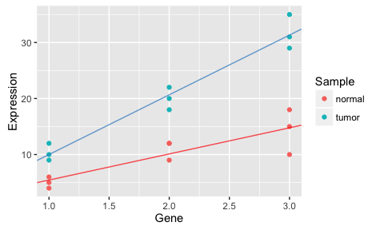

# ANCOVA analysis


```r
library(ggplot2)
```

```
## Warning: package 'ggplot2' was built under R version 3.1.3
```

```r
data = read.csv('/Users/changc25/Desktop/gene_exp_test.csv')
data
```

```
##    Expression Sample Gene
## 1          10  tumor    1
## 2          22  tumor    2
## 3          31  tumor    3
## 4           9  tumor    1
## 5          18  tumor    2
## 6          29  tumor    3
## 7          12  tumor    1
## 8          20  tumor    2
## 9          35  tumor    3
## 10          5 normal    1
## 11          9 normal    2
## 12         10 normal    3
## 13          6 normal    1
## 14         12 normal    2
## 15         18 normal    3
## 16          4 normal    1
## 17         12 normal    2
## 18         15 normal    3
```

```r
ggplot(data, aes(x=Gene, y=Expression)) + geom_point(aes(colour = Sample))
```

<!-- -->

### Fit Individual Sample

```r
model_tumor = lm(Expression~Gene, data=data[data$Sample=='tumor',])
model_normal = lm(Expression~Gene, data=data[data$Sample=='normal',])

coef(model_tumor)
```

```
## (Intercept)        Gene 
##  -0.6666667  10.6666667
```

```r
coef(model_normal)
```

```
## (Intercept)        Gene 
##   0.7777778   4.6666667
```

The tumor sample has  slope = 10.67, intercept = -0.67

The normal sample has slope = 4.67,  intercept =  0.78

### Comparing Two Samples with two different models

```r
model1 = lm(Expression~Sample*Gene, data=data)
model2 = lm(Expression~Sample+Gene, data=data)
```

model1 is equivalent to:
**Expression ~ Gene + Sample + Gene:Sample**
And it means the Expression may be affected by three things:

  1. gene (different gene/SNP will cause different gene expression)
  2. sample (tumor sample shifts the y value but does not change the slope. This means tumor may have some effects on the overall expression that is unrelated to the gene.)
  3. gene expression rate is afected by the sample type (different sample has different rate/slope in their gene expression)

model2 assumes the expression may be affected by only the first two as mentioned above, and there is no interaction between sample and gene.
  
  1. default gene expression rate (no matter it's tumor or nomal)
  2. some effect from the sample that has no effect on the gene (could be sampling error from TCGA data or something else)
  
Here we can compare the R^2 to see which model performs better, then we know whether sample has any effect on the gene and how significant that is. Instead of simply looking at the R^2, you can perform statistical test on this two model using **anova** 

```r
anova(model1, model2)
```

```
## Analysis of Variance Table
## 
## Model 1: Expression ~ Sample * Gene
## Model 2: Expression ~ Sample + Gene
##   Res.Df     RSS Df Sum of Sq      F    Pr(>F)    
## 1     14  77.556                                  
## 2     15 185.556 -1      -108 19.496 0.0005872 ***
## ---
## Signif. codes:  0 '***' 0.001 '**' 0.01 '*' 0.05 '.' 0.1 ' ' 1
```
Basically, the Pr(>F), that's p-value and is small, suggesting this two models are different. And if you look at the R^2 for model1 is better than model2 (below), saying model1 is more correct, and there is sample-gene interaction in this data.


```r
print(paste('model1 R^2:', summary(model1)$r.squared))
```

```
## [1] "model1 R^2: 0.944295917960177"
```

```r
print(paste('model2 R^2:', summary(model2)$r.squared))
```

```
## [1] "model2 R^2: 0.866725190535094"
```

### How significant is this sample-gene interaction?

```r
summary(model1)
```

```
## 
## Call:
## lm(formula = Expression ~ Sample * Gene, data = data)
## 
## Residuals:
##     Min      1Q  Median      3Q     Max 
## -4.7778 -1.0833 -0.1667  1.7500  3.6667 
## 
## Coefficients:
##                  Estimate Std. Error t value Pr(>|t|)    
## (Intercept)        0.7778     2.0757   0.375 0.713497    
## Sampletumor       -1.4444     2.9355  -0.492 0.630305    
## Gene               4.6667     0.9609   4.857 0.000254 ***
## Sampletumor:Gene   6.0000     1.3589   4.415 0.000587 ***
## ---
## Signif. codes:  0 '***' 0.001 '**' 0.01 '*' 0.05 '.' 0.1 ' ' 1
## 
## Residual standard error: 2.354 on 14 degrees of freedom
## Multiple R-squared:  0.9443,	Adjusted R-squared:  0.9324 
## F-statistic: 79.11 on 3 and 14 DF,  p-value: 5.1e-09
```

```r
ggplot(data, aes(x=Gene, y=Expression, colour = Sample)) + geom_point() +
  geom_abline(intercept = coef(model1)[['(Intercept)']], slope = coef(model1)[['Gene']], color = "red", alpha = 0.7) + 
  geom_abline(intercept = coef(model1)[['(Intercept)']] + coef(model1)[['Sampletumor']], slope = coef(model1)[['Gene']] + coef(model1)[['Sampletumor:Gene']], color = "steelblue3", alpha = 0.8) 
```

<!-- -->
From the model_tumor and model_normal, we know:

The tumor sample has  slope = 10.67, intercept = -0.67

The normal sample has slope = 4.67,  intercept =  0.78

The **'Sampletumor:Gene'** is the (tumor slope) - (normal slope). 6 = 10.67 - 4.67. The the p-value is small, saying these two slopes are significally different. 

**'(intercept)'** is the intercept of **normal** sample. 

**'Sampletumor'** is the difference between (tumor intercept) and (normal intercept). -0.67 - 0.78 = -1.45 (or -1.4444)

**'Gene'** is the slope of **normal** sample. 

And from Sampletumor:Gene, we can calculate the slope of tumor sample: 4.6667 + 6.0000 = 10.6667, same as what we got from model_tumor.


```r
summary(model2)
```

```
## 
## Call:
## lm(formula = Expression ~ Sample + Gene, data = data)
## 
## Residuals:
##     Min      1Q  Median      3Q     Max 
## -7.7778 -2.2778  0.4444  1.8889  6.6667 
## 
## Coefficients:
##             Estimate Std. Error t value Pr(>|t|)    
## (Intercept)   -5.222      2.345  -2.227   0.0417 *  
## Sampletumor   10.556      1.658   6.366 1.27e-05 ***
## Gene           7.667      1.015   7.551 1.74e-06 ***
## ---
## Signif. codes:  0 '***' 0.001 '**' 0.01 '*' 0.05 '.' 0.1 ' ' 1
## 
## Residual standard error: 3.517 on 15 degrees of freedom
## Multiple R-squared:  0.8667,	Adjusted R-squared:  0.849 
## F-statistic: 48.77 on 2 and 15 DF,  p-value: 2.727e-07
```

```r
ggplot(data, aes(x=Gene, y=Expression, colour = Sample)) + geom_point() +
  geom_abline(intercept = coef(model2)[['(Intercept)']], slope = coef(model2)[['Gene']], color = "red", alpha = 0.7) + 
  geom_abline(intercept = coef(model2)[['(Intercept)']] + coef(model2)[['Sampletumor']], slope = coef(model2)[['Gene']], color = "steelblue3", alpha = 0.8) 
```

<!-- -->
Model2 assumes there is no interaction between sample and gene, so it uses only one slope to fit these two samples. The fitted slope will close to the average slope of model_tumor and model_normal.

**'(intercept)'** is the intercept of **normal** sample. 

**'Sampletumor'** is the difference between (tumor intercept) and (normal intercept).

**'Gene'** is the average slope of this model (there is only one slope in this model because it assumes there is not interaction between sample and gene). It is close to (10.67 + 4.67) / 2.
